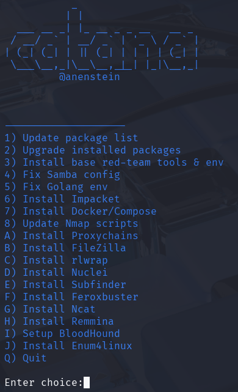

# catana
Catana is an interactive Red Team infrastructure bootstrapper for Kali Linux. It automates the installation and setup of essential offensive security tools, environments and configurations.

---

## Features

- install of essential Red Team tools and environments
- Python virtual environment
- Peass-NG suite installation
- Decompression of rockyou wordlist
- Docker & Docker Compose setup and fix
- Tools like Nmap, Go, FileZilla, Proxychains, Remmina, rlwrap, Impacket, Subfinder, and more
- BloodHound setup in a dedicated `tmux` session
- Fixes and configurations for Samba and Golang environments

---

## Screenshot

  

---

## Requirements

- Kali Linux (or compatible Debian-based distro)
- Root privileges (sudo)
- Internet connection
- Standard CLI tools: apt, bash, git, etc.

---

## Installation

# 1. Clone the repo and change directory
git clone https://github.com/anenstein/catana.git
cd catana

# 2. Run the installer for the first time
sudo bash ./catana.sh

# 3. From now on you can run Catana directly
sudo catana

# ——————————————————————————
# 4. To pull in updates and reinstall system-wide:
cd catana
git pull https://github.com/anenstein/catana.git

#    Re-run the installer script to update /usr/local/bin/catana
sudo ./catana.sh

## Disclaimer

Catana is intended for educational and authorized penetration testing use only. Always obtain proper permission before using tools that interact with or scan remote systems.

